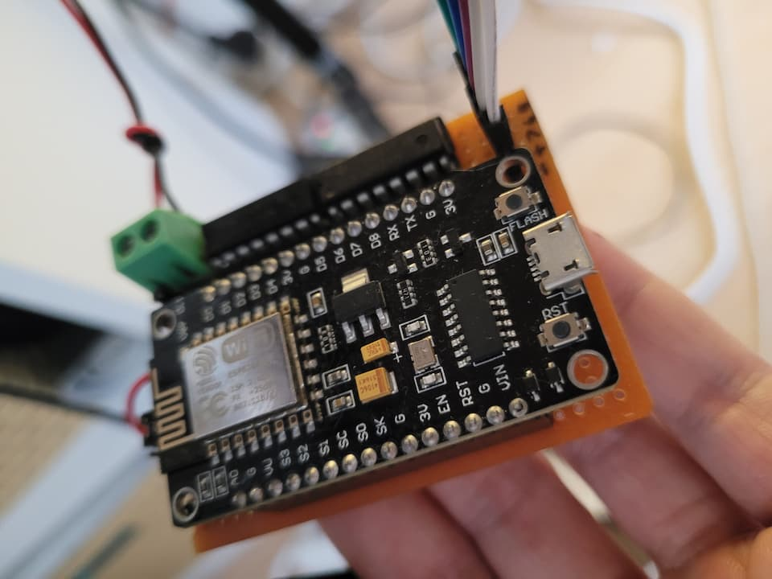

# ESP8266 - NodeMCU Led Control over WiFi
<p align="center">
  <picture>
    
  </picture>
</p>

## How it works?
The ESP8266 starts up as an access point and creates a WiFi network. You can connect to the access point from any device and go to [192.168.10.1](http://192.168.10.1) on your browser and you can configure which wifi network the ESP8266 should connect to and also the API token which will be used to control the brightness. Once the ESP8266 connects to the WiFi network, it saves the credentials and restarts. After that ESP8266 connects to the WiFi network and starts a web server. You can connect to the WiFi network from any device and control the LED connected to the ESP8266.

## API

The brightness of the LED value is between 0 and 1023.

### GET /get
> Returns the status of the LED in JSON format.
>
> Parameters:
> - token: API token

```
758
```

### GET /update
> Updates the brightness of the LED.
>
> Parameters:
> - token: API token
> - value: Brightness of the LED (0-1023)
> - save (optional): If true, the brightness will be saved to the EEPROM

```
ok
```

## Flash button cases

You can use Flash button on NodeMCU for some functions.

**While Running:**
| Times Clicked | Function |
| ------------- | -------- |
| 2 | Restart NodeMCU |
| 3 | Flash config |

### Notes:
- When you restart the device if you keep pressing on Flash button, the device will Flash network credentials and start as an access point.